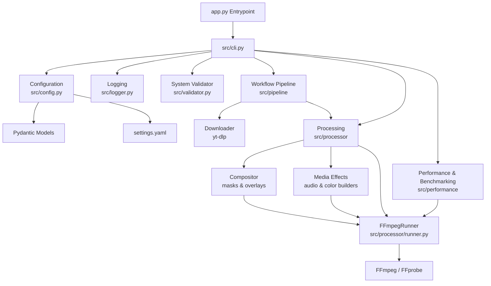

# YouTube CashCow

A production-grade, modular video automation platform. YouTube CashCow takes a video from source to finished upload-ready output through a single configurable pipeline: downloading, FFmpeg processing, masked compositing, workflow automation, and hardware-accelerated encoding, all with built-in benchmarking.

## 🚀 Project Overview

YouTube CashCow is built as a modular pipeline architecture where each subsystem is independent and composable. It combines a robust codebase foundation (typed configuration, Rich-backed logging, a Typer CLI, and environment validation) with a full media stack:

- **Downloading** — concurrent video/audio retrieval with metadata, playlists, and cookie authentication via `yt-dlp`.
- **Processing** — a local-media FFmpeg façade for trim, crop, resize, rotate, overlay, watermark, subtitles, thumbnails, concat, and audio operations.
- **Compositing** — masked image/video overlays with feathering, scaling, rotation, and opacity.
- **Media effects** — a chainable, FFmpeg-only audio-effects engine (pitch, deep voice, chipmunk, volume, echo, bass, treble, normalize, speed) and color-grading engine (brightness, contrast, saturation, gamma, hue, temperature, tint, vibrance), including selective grading of individual overlays.
- **Workflow automation** — YAML-defined pipelines with isolated workspaces, retries, validation, and automatic cleanup.
- **Hardware acceleration** — automatic encoder detection across Apple VideoToolbox, NVIDIA NVENC, and Intel Quick Sync, with a software fallback.
- **Benchmarking** — encoder, transcode, quality, and end-to-end pipeline profiling with structured JSON reports.

A modern web frontend, interactive editing tools, and YouTube upload automation are on the roadmap.

## 🏗️ Architecture



The system comprises the following key components:
- **CLI Subsystem**: Driven by `Typer` and `Rich` for user interaction and diagnostic readouts.
- **Configuration Subsystem**: Loads `settings.yaml` and executes rigid schema validation using `Pydantic`.
- **System Validator**: Runs pre-flight diagnostics assessing Python runtime requirements, dependency existence, folder structure, and access permissions.
- **Logging Subsystem**: Features colorized console logs (via Rich) alongside rotating, daily file loggers.
- **Download Subsystem**: `yt-dlp`-backed video/audio retrieval with metadata extraction, playlist support, format selection, and cookie authentication.
- **Processing Subsystem**: A local-media-only FFmpeg façade for composable trim, transforms, audio, subtitle, thumbnail, and concat operations.
- **Compositing Subsystem**: Layers masked, feathered, scaled, and rotated image/video overlays onto the base video (`mask.py`, `overlay.py`, `compositor.py`).
- **Media Effects Subsystem**: FFmpeg-only, registry-driven audio (`audio.py`) and color (`color.py`) builders that return filter fragments the Processor assembles; effects are chainable, fully typed, and identity operations are elided so no wasted filters are emitted.
- **Workflow Pipeline**: Coordinates the downloader and processor from YAML definitions with isolated workspaces, retries, validation, and cleanup.
- **Performance Engine**: Detects hardware encoders, selects the fastest backend with a software fallback, and benchmarks encoder, transcode, quality, and full-pipeline profiles.
- **FFmpeg Runner**: The single point of FFmpeg/FFprobe execution — every subsystem routes its commands through `src/processor/runner.py`.

---

## 📂 Folder Structure

```text
youtube-cashcow/
├── app.py                   # Root application entry point
├── requirements.txt         # Package dependencies
├── settings.yaml            # Main application configuration file
├── .env                     # Environment override variables (git ignored)
├── .env.example             # Template for environment configuration
├── .gitignore               # Ignored version control paths
├── README.md                # Project documentation
│
├── src/                     # Core source package
│   ├── __init__.py          # Exports config, loggers, exceptions, and validators
│   ├── config.py            # Pydantic settings models and safe loading logic
│   ├── logger.py            # Colored Console (Rich) and Rotating File logging
│   ├── cli.py               # Typer command setup and layout definition
│   ├── validator.py         # System dependency, directory, and version validation
│   ├── constants.py         # Application metadata and extension configurations
│   ├── exceptions.py        # Typed application exceptions
│   └── utils.py             # Filesystem, timestamp, and permission utilities
│
├── assets/                  # Overlays, watermarks, intros, and masks
│   ├── overlays/
│   ├── logos/
│   ├── masks/
│   ├── intro/
│   └── outro/
│
├── downloads/               # Directory for temporary downloaded video files
├── temp/                    # Workspace directory for processing clips
├── output/                  # Final output directory for processed videos
├── logs/                    # Folder containing daily rotating log files
└── tests/                   # Test suite for unit and system checks
```

---

## 🔧 Installation & Virtual Environment

Follow these steps to set up the workspace:

### 1. Clone the repository and navigate inside
```bash
git clone <repository_url> youtube-cashcow
cd youtube-cashcow
```

### 2. Create and Activate Virtual Environment
Use Python 3.12+ to create a virtual environment:
```bash
python3.12 -m venv .venv
source .venv/bin/activate
```

### 3. Install Package Dependencies
Install the required packages using pip:
```bash
pip install --upgrade pip
pip install -r requirements.txt
```

### 4. Create local environment settings
Copy the environment file template to local configuration:
```bash
cp .env.example .env
```

---

## 💻 CLI Commands

Run the application using the following Typer commands:

### Running initialization
Initializes folders, registers logging channels, checks requirements, and verifies write access:
```bash
python app.py run
```

### Running diagnostics (doctor)
Runs diagnostic checks against your settings file, imports, folders, permissions, and Python version:
```bash
python app.py doctor
```

### Inspecting active configuration
Prints out a validated schema dump of the active settings:
```bash
python app.py config
```

### Viewing application version
Prints version information:
```bash
python app.py version
```

---

## ⚙️ Configuration File (settings.yaml)

Configuration is managed via `settings.yaml` and validated at runtime:

```yaml
app:
  name: "YouTube CashCow"
  version: "1.0.0"
  debug: true

logging:
  level: "INFO"
  console_output: true
  file_output: true
  log_dir: "logs"

storage:
  download_dir: "downloads"
  temp_dir: "temp"
  output_dir: "output"
  assets_dir: "assets"
```

---

## 🎬 FFmpeg processing (Phase 3)

The processor is independent of downloading and only accepts local paths. Install both
`ffmpeg` and `ffprobe` first:

- macOS: `brew install ffmpeg`
- Ubuntu/Debian: `sudo apt install ffmpeg`
- Windows: install a current FFmpeg build, then add its `bin` directory to `PATH`.

Configure custom executable paths, command timeout, threads, or optional hardware
acceleration in the `ffmpeg` block in `settings.yaml`.

```python
from src.config import load_config
from src.processor import Processor

processor = Processor(load_config())
clip = processor.trim("downloads/source.webm", "output/clip.mp4", start=4, end=18)
vertical = processor.resize(clip.output_file, "output/short.mp4", preset="1080x1920", padding=True)
processor.watermark(vertical.output_file, "output/branded.mp4", text="@mychannel")
processor.thumbnail("output/branded.mp4", "output/thumbnail.jpg", timestamp=3)
```

Available operations include `trim`, `crop`, `resize`, `rotate`, `overlay`,
`composite` (masked overlays, see Phase 6), `watermark`, `burn_subtitles`,
`thumbnail`, `concat`, `extract_audio`, `replace_audio`, `mute`, `volume`, and
`normalize`. Every successful operation returns
a typed `ProcessingResult`; `inspect()` returns `VideoInfo`. Operations accept optional
`progress` callbacks and cancellation events where applicable.

---

## 🔁 Workflow pipelines (Phase 4)

`src.pipeline` coordinates the downloader and the existing local-media `Processor`; it
does not contain FFmpeg commands or downloading logic. Every run receives an isolated
workspace, records typed step history, retries recoverable failures, and removes its
intermediate files after success by default. Processing steps always call the Processor
API rather than constructing commands themselves.

```yaml
name: shorts_pipeline
retry:
  attempts: 3
steps:
  - download:
      url: https://youtube.com/watch?v=example
  - trim:
      start: 5
      end: 45
  - resize:
      preset: 1080x1920
      padding: true
  - watermark:
      text: "@mychannel"
  - thumbnail:
      second: 12
  - export:
      output: output/final.mp4
```

Validate or run it with:

```bash
python app.py pipeline validate workflow.yaml
python app.py pipeline run workflow.yaml
```

Each `steps` item is a one-key YAML mapping. Built-in names are `download`, `source`,
`trim`, `crop`, `resize`, `rotate`, `overlay`, `watermark`, `subtitles`, `thumbnail`,
`concat`, `encode`, `audio_effect`, `color_effect`, and `export`. `download`, `source`,
(or a file-based `concat`) must establish input media first; `export` is required and
must be last. File-valued options such as overlay images and subtitle files are resolved
relative to the workflow YAML file.

For `resize`, dimension presets include `1080x1920`, `1920x1080`, `1080x1080`,
`720p`, and `4k`. Pipeline-only platform aliases are also available: `youtube`
maps to `1920x1080`; `shorts`, `tiktok`, and `instagram` map to `1080x1920`.

To add a custom step, subclass `src.pipeline.steps.base.PipelineStep`, implement
`validate()` and `execute(context, runner)`, then register it with
`registry.register("name", YourStep)`. Steps should update `context.current_file` and
use `runner.processor` for media transformations.

---

## ⚡ Performance engine (Phase 5)

The performance layer detects FFmpeg encoders automatically and keeps all FFmpeg
execution in `src/processor/runner.py`. On Apple Silicon it prefers
`h264_videotoolbox` (or `hevc_videotoolbox` when requested), then uses NVIDIA NVENC,
Intel Quick Sync, and finally software `libx264`/`libx265`/`libsvtav1`. Existing
`Processor` methods do not change; their internal encoding options are selected at
runtime and retain a software fallback when hardware is unavailable.

```bash
python app.py hardware
python app.py performance
python app.py benchmark input.mp4
python app.py benchmark input.mp4 --profile encoder --duration 30
python app.py benchmark input.mp4 --profile transcode
python app.py benchmark input.mp4 --profile quality --json benchmark.json
python app.py benchmark input.mp4 --profile pipeline --json pipeline.json
python app.py benchmark workflow.yaml --profile pipeline
```

`hardware` lists compiled FFmpeg encoders. `benchmark` first inspects the input
(codec, resolution, duration, fps, bitrate), detects the decode path — for example
`Software (libdav1d)` for AV1 or `Hardware (<method>)` when `ffmpeg.hwaccel` is
configured — and the encode backend, then prints an Input and a Benchmark panel
before running.

Profiles control scope:

- **`encoder`** (default) benchmarks a short clip (30s) so encoder throughput is
  isolated from software decode cost. This is the fix for AV1/HEVC inputs where
  software decode would otherwise dominate the measured time.
- **`transcode`** benchmarks the full file and measures the complete decode +
  encode pipeline.
- **`quality`** encodes several presets on the fastest available backend and
  compares output size, elapsed time, and fps.
- **`pipeline`** runs a complete production workflow end-to-end and answers "how
  long would a real workflow take?" (see below).

`--duration N` limits every encoder to the same `N`-second clip via FFmpeg's `-t`
option (clamped to the source length). The structured report shows encoder, decoder,
preset, elapsed, average fps, speed (x realtime), output size, CPU share, memory
high-water mark, resolution, and input codec. `--json <file>` writes the full report
as machine-readable JSON for regression testing. Benchmark outputs are temporary;
the typed report retains their measured sizes.

#### Pipeline profile

The `pipeline` profile measures a real production workflow rather than a synthetic
FFmpeg command. It runs the actual `PipelineRunner`, so every step executes exactly
as in production and all FFmpeg work stays inside `src/processor/runner.py` — the
benchmark orchestrates existing components and never duplicates processing logic.

```bash
# Media file: a synthetic source -> trim -> resize -> encode -> export workflow
python app.py benchmark input.mp4 --profile pipeline --duration 5

# Workflow YAML: your own workflow is reused verbatim
python app.py benchmark workflow.yaml --profile pipeline --json pipeline.json
```

Timing is captured by observing the runner's own progress events, not by
re-implementing timers. Wall clock is split into `init`, `download` (when a
`download` step is present), `processing`, `encoding`, `export`, and `cleanup`
buckets, and each executed step reports its start, duration, and status:

```
Pipeline Benchmark            Step Breakdown
Pipeline:    benchmark_pipeline    Step     Start    Duration   Status
Hardware:    videotoolbox          source   0.00 s   0.00 s     completed
Encoder:     h264_videotoolbox     trim     0.00 s   0.53 s     completed
Decoder:     Software (h264)       resize   0.53 s   0.49 s     completed
Resolution:  1920x1080             encode   1.02 s   0.55 s     completed
Total Time:  1.58 s                export   1.57 s   0.00 s     completed
Encoding:    0.55 s
```

`--json <file>` writes the full pipeline report (profile, pipeline name, hardware,
encoder, decoder, per-bucket timings, and the complete `steps` array with per-step
timing and status). Serialization stays in the CLI layer.

**Interpreting the result.** `encoding` is the time spent in the encode step alone;
`processing` covers trim/resize/overlay/watermark/subtitle work; a large gap between
`total` and the sum of encode + processing points at I/O (download, export) or
initialization overhead. **Recommended usage:** benchmark the same workflow YAML you
run in production, keep `--duration` small (a few seconds) for fast iteration, and
compare the JSON `encoding_time` and `total_time` across encoder or hardware changes.

A media-file input requires no workflow authoring — the benchmark builds an in-memory
workflow from the existing Pipeline models. Local files can also be fed to any
workflow through the new `source` step (`source: {path: clip.mp4}`), the offline
counterpart to `download`.

Tune the behavior in `settings.yaml`:

```yaml
performance:
  hardware: "auto"        # auto, videotoolbox, nvenc, qsv, software
  workers: "auto"         # CPU-aware pool: available CPUs minus one
  benchmark: true
  metrics: true
  preferred_encoder: "auto"
  fallback: "software"
```

Production encoding presets are available as `src.performance.Preset`: `YOUTUBE_1080`,
`YOUTUBE_4K`, `SHORTS`, `TIKTOK`, `INSTAGRAM`, `ARCHIVE`, and `LOSSLESS`. They carry
bitrate, audio bitrate, pixel format, GOP, fast-start, threading, and hardware
preference defaults. Apple VideoToolbox decisions use hardware bitrate/quality options
and `+faststart`, avoiding CPU encoding whenever the installed FFmpeg exposes it.

---

## 🎭 Masking & compositing (Phase 6)

The compositing engine lays a masked image or video overlay onto the base video,
the way CapCut, Premiere, and DaVinci masks work. It slots into the existing
chain — `Pipeline → Processor → Compositor → FFmpegRunner` — so every command
still executes only inside `src/processor/runner.py`. Three concerns stay
isolated: `mask.py` generates alpha shapes, `overlay.py` resolves
position/scale/rotation, and `compositor.py` assembles the filter graph.

The base video is always fully visible outside the mask; only the overlay is
scaled, masked, feathered, rotated, and faded.

Add an `overlay` step with a `source` (image or video):

```yaml
name: masked_overlay
steps:
  - source:
      path: input.mp4
  - overlay:
      source: assets/overlays/face.mp4
      position:
        x: center
        y: center
      scale: 0.4
      opacity: 1.0
      rotation: 0
      mask:
        type: circle
        feather: 40
  - export:
      output: output/final.mp4
```

**Mask configuration.** `type` selects the shape (`circle` and `ellipse` today;
the registry in `mask.py` accepts `rectangle`, `polygon`, and `alpha` later
without touching callers). `feather` is the soft-edge radius in pixels, `width`
and `height` size the shape (defaults fill the overlay), `rotation` turns it,
and `invert` keeps the outside instead of the inside.

**Overlay configuration.** `position` accepts named anchors (`center`,
`top_left`, `top_right`, `bottom_left`, `bottom_right`, `top`, `bottom`, `left`,
`right`) or pixel coordinates. Scaling is either `scale` or explicit
`width`/`height` in pixels — not both. A fractional `scale` sizes the overlay
relative to the output frame (cover/fill), not to the overlay's own dimensions:
`scale: 1.0` fully covers the frame with no black borders, `scale: 0.5` covers
half the frame, and `scale: 2.0` is twice the frame. Aspect ratio is preserved
and any excess is cropped. Explicit `width`/`height` remain fixed pixel sizes.
`opacity` is an alpha multiplier applied after the mask, and `rotation` turns the
overlay. Image and video overlays use the same configuration; a still image is
held for the base's full duration automatically.

The programmatic API mirrors the other operations:

```python
from src.processor import Processor, OverlayConfig, MaskConfig

processor = Processor(load_config())
processor.composite("input.mp4", "output/final.mp4", OverlayConfig(
    source="assets/overlays/face.mp4", x="center", y="center", scale=0.4,
    mask=MaskConfig(type="circle", feather=40),
))
```

The legacy image-only `overlay` step (an `image:` key) is unchanged and still
works.

**Performance notes.** Masking uses FFmpeg's `geq` filter to draw the alpha
shape, which is evaluated per pixel and is more expensive than a plain overlay;
feathering is folded into the same pass rather than adding a second encode.
Overlay time appears as its own line in the pipeline benchmark's step breakdown
(alongside `encode` and `export`) with no benchmark changes. Do **not** wrap
image overlays in `-loop`/`-shortest`: the `overlay` filter already repeats the
last overlay frame for the base's duration, and an unbounded looped image stream
will hang the encode.

---

## 🎚️ Media effects engine (Phase 7)

The media effects engine adds FFmpeg-only audio processing and color grading. It
keeps the existing chain — `Pipeline → Processor → Audio/Color builders →
FFmpegRunner` — so every command still executes only inside
`src/processor/runner.py`. There are **no AI models**; every effect is a plain
FFmpeg filter. Two concerns stay isolated: `audio.py` builds `-af` fragments and
`color.py` builds `-vf` fragments, both through small registries the Processor
assembles. Builders only produce strings; nothing there runs a command.

### Audio effects

Add an `audio_effect` step with either a single inline effect or an `effects`
chain. Effects apply left to right.

```yaml
steps:
  - source:
      path: input.mp4

  # single effect
  - audio_effect:
      type: pitch
      semitones: 2

  # chained effects
  - audio_effect:
      effects:
        - type: normalize
        - type: bass
        - type: volume
          gain: 4

  - export:
      output: output/final.mp4
```

Supported types and their knobs:

| Type | Knob | FFmpeg filter |
| --- | --- | --- |
| `pitch` | `semitones` (-24..24) | `asetrate`+`aresample`+`atempo` (duration preserved) |
| `deep_voice` | *(none; preset pitch)* | pitch shift down |
| `chipmunk` | *(none; preset pitch)* | pitch shift up |
| `volume` | `gain` dB (-60..60) | `volume` |
| `echo` | `delay` ms, `decay` (0..1) | `aecho` |
| `bass` | `gain` dB (-60..60) | `bass` |
| `treble` | `gain` dB (-60..60) | `treble` |
| `normalize` | *(none)* | `loudnorm` |
| `speed` | `factor` (0.5..100) | `atempo` chain |

`speed` decomposes any factor into a product of in-range `atempo` stages (each
0.5–2.0), so large speed changes stay valid.

### Color effects

Add a `color_effect` step. Every knob defaults to its identity value, so only the
knobs you set are emitted.

```yaml
steps:
  - source:
      path: input.mp4
  - color_effect:
      brightness: 0.05
      contrast: 1.2
      saturation: 1.3
  - export:
      output: output/final.mp4
```

| Knob | Range | FFmpeg filter |
| --- | --- | --- |
| `brightness` | -1..1 | `eq` |
| `contrast` | 0..3 | `eq` |
| `saturation` | 0..3 | `eq` |
| `gamma` | 0..10 | `eq` |
| `hue` | -360..360 | `hue` |
| `temperature` | -1..1 (warm/cool) | `colorbalance` |
| `tint` | -1..1 (green/magenta) | `colorbalance` |
| `vibrance` | -2..2 | `vibrance` |

`brightness`/`contrast`/`saturation`/`gamma` collapse into a single `eq` node.

### Selective color grading (overlays)

An `overlay` step accepts an optional `color` block. The grade is applied to the
overlay's own pixels **before** compositing, so only the overlay is recoloured
and the base video is untouched.

```yaml
  - overlay:
      source: assets/overlays/logo.png
      scale: 0.4
      color:
        brightness: 0.1
        saturation: 1.4
        hue: 20
```

### Programmatic API

```python
from src.processor import Processor, AudioEffectConfig, ColorEffectConfig

processor = Processor(load_config())
processor.apply_audio_effect("in.mp4", "out.mp4", {"effects": [{"type": "normalize"}, {"type": "bass"}]})
processor.apply_color_effect("in.mp4", "graded.mp4", {"saturation": 1.3, "hue": 15})
```

**Performance notes.** Identity operations are elided: a `volume` of 0 dB, a
`speed` of 1.0, a `pitch` of 0 semitones, and any color knob left at its neutral
value contribute no filter. An all-identity chain produces an empty filter graph,
and the pipeline step skips FFmpeg entirely rather than emitting a pointless
re-encode. The pipeline benchmark reports dedicated `audio` and `color` timing
buckets plus a `filter_graph_time` (the pure-Python cost of turning effect
configs into filter strings, isolated from the encode cost); all three appear in
the `--json` report.

---

## 🗺️ Future Roadmap

- **Modern Web Frontend** — a browser-based UI for building and running workflows.
- **Interactive Timeline Editor** — visual, frame-accurate editing on a timeline.
- **Drag-and-drop trimming** — direct manipulation of clip boundaries.
- **Visual Workflow Builder** — compose pipeline steps without writing YAML.
- **Audio Enhancement Engine** — noise reduction, leveling, and mastering.
- **AI Scene Detection** — automatic shot and scene segmentation.
- **Auto Caption Generation** — speech-to-text captions and subtitle export.
- **Batch Processing** — run workflows across many inputs in parallel.
- **YouTube Upload Automation** — authenticated uploads via the YouTube Data API.
- **Job Scheduling** — queue and schedule recurring workflow runs.
- **Plugin System** — third-party steps and integrations through a stable extension API.
