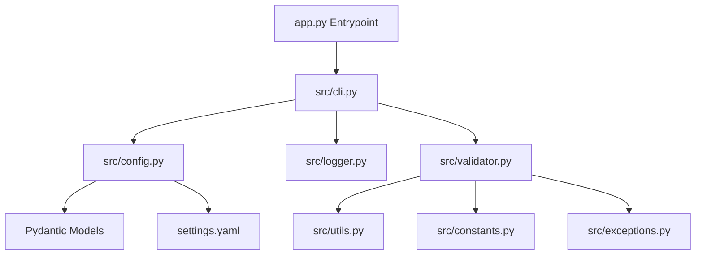

# YouTube CashCow

An automated, scalable, production-grade video processing platform. This repository contains the core foundation (Phase 1) designed to support future workloads such as video downloading, heavy processing, custom transitions, audio mastering, and YouTube uploads.

## 🚀 Project Overview

YouTube CashCow is designed as a modular pipeline architecture. The goal of Phase 1 is to implement a robust codebase foundation featuring a configuration engine, custom typed logger with Rich support, CLI entry points, and environment verification rules.

## 🏗️ Architecture



The system comprises the following key components:
- **CLI Subsystem**: Driven by `Typer` and `Rich` for user interaction and diagnostic readouts.
- **Configuration Subsystem**: Loads `settings.yaml` and executes rigid schema validation using `Pydantic`.
- **System Validator**: Runs pre-flight diagnostics assessing Python runtime requirements, dependency existence, folder structure, and access permissions.
- **Logging Subsystem**: Features colorized console logs (via Rich) alongside rotating, daily file loggers.
- **Processing Subsystem**: A local-media-only FFmpeg façade for composable trim, transforms, audio, subtitle, thumbnail, and concat operations.

---

## 📂 Folder Structure

```text
youtube-cashcow/
├── app.py                   # Root application entry point
├── requirements.txt         # Package dependencies
├── settings.yaml            # Main application configuration file
├── .env                     # Environment override variables (git ignored)
├── .env.example             # Template for environment configuration
├── .gitignore               # Ignored version control paths
├── README.md                # Project documentation
│
├── src/                     # Core source package
│   ├── __init__.py          # Exports config, loggers, exceptions, and validators
│   ├── config.py            # Pydantic settings models and safe loading logic
│   ├── logger.py            # Colored Console (Rich) and Rotating File logging
│   ├── cli.py               # Typer command setup and layout definition
│   ├── validator.py         # System dependency, directory, and version validation
│   ├── constants.py         # Application metadata and extension configurations
│   ├── exceptions.py        # Typed application exceptions
│   └── utils.py             # Filesystem, timestamp, and permission utilities
│
├── assets/                  # Overlays, watermarks, intros, and masks
│   ├── overlays/
│   ├── logos/
│   ├── masks/
│   ├── intro/
│   └── outro/
│
├── downloads/               # Directory for temporary downloaded video files
├── temp/                    # Workspace directory for processing clips
├── output/                  # Final output directory for processed videos
├── logs/                    # Folder containing daily rotating log files
└── tests/                   # Test suite for unit and system checks
```

---

## 🔧 Installation & Virtual Environment

Follow these steps to set up the workspace:

### 1. Clone the repository and navigate inside
```bash
git clone <repository_url> youtube-cashcow
cd youtube-cashcow
```

### 2. Create and Activate Virtual Environment
Use Python 3.12+ to create a virtual environment:
```bash
python3.12 -m venv .venv
source .venv/bin/activate
```

### 3. Install Package Dependencies
Install the required packages using pip:
```bash
pip install --upgrade pip
pip install -r requirements.txt
```

### 4. Create local environment settings
Copy the environment file template to local configuration:
```bash
cp .env.example .env
```

---

## 💻 CLI Commands

Run the application using the following Typer commands:

### Running initialization
Initializes folders, registers logging channels, checks requirements, and verifies write access:
```bash
python app.py run
```

### Running diagnostics (doctor)
Runs diagnostic checks against your settings file, imports, folders, permissions, and Python version:
```bash
python app.py doctor
```

### Inspecting active configuration
Prints out a validated schema dump of the active settings:
```bash
python app.py config
```

### Viewing application version
Prints version information:
```bash
python app.py version
```

---

## ⚙️ Configuration File (settings.yaml)

Configuration is managed via `settings.yaml` and validated at runtime:

```yaml
app:
  name: "YouTube CashCow"
  version: "1.0.0"
  debug: true

logging:
  level: "INFO"
  console_output: true
  file_output: true
  log_dir: "logs"

storage:
  download_dir: "downloads"
  temp_dir: "temp"
  output_dir: "output"
  assets_dir: "assets"
```

---

## 🎬 FFmpeg processing (Phase 3)

The processor is independent of downloading and only accepts local paths. Install both
`ffmpeg` and `ffprobe` first:

- macOS: `brew install ffmpeg`
- Ubuntu/Debian: `sudo apt install ffmpeg`
- Windows: install a current FFmpeg build, then add its `bin` directory to `PATH`.

Configure custom executable paths, command timeout, threads, or optional hardware
acceleration in the `ffmpeg` block in `settings.yaml`.

```python
from src.config import load_config
from src.processor import Processor

processor = Processor(load_config())
clip = processor.trim("downloads/source.webm", "output/clip.mp4", start=4, end=18)
vertical = processor.resize(clip.output_file, "output/short.mp4", preset="1080x1920", padding=True)
processor.watermark(vertical.output_file, "output/branded.mp4", text="@mychannel")
processor.thumbnail("output/branded.mp4", "output/thumbnail.jpg", timestamp=3)
```

Available operations include `trim`, `crop`, `resize`, `rotate`, `overlay`,
`watermark`, `burn_subtitles`, `thumbnail`, `concat`, `extract_audio`,
`replace_audio`, `mute`, `volume`, and `normalize`. Every successful operation returns
a typed `ProcessingResult`; `inspect()` returns `VideoInfo`. Operations accept optional
`progress` callbacks and cancellation events where applicable.

---

## 🔁 Workflow pipelines (Phase 4)

`src.pipeline` coordinates the downloader and the existing local-media `Processor`; it
does not contain FFmpeg commands or downloading logic. Every run receives an isolated
workspace, records typed step history, retries recoverable failures, and removes its
intermediate files after success by default. Processing steps always call the Processor
API rather than constructing commands themselves.

```yaml
name: shorts_pipeline
retry:
  attempts: 3
steps:
  - download:
      url: https://youtube.com/watch?v=example
  - trim:
      start: 5
      end: 45
  - resize:
      preset: 1080x1920
      padding: true
  - watermark:
      text: "@mychannel"
  - thumbnail:
      second: 12
  - export:
      output: output/final.mp4
```

Validate or run it with:

```bash
python app.py pipeline validate workflow.yaml
python app.py pipeline run workflow.yaml
```

Each `steps` item is a one-key YAML mapping. Built-in names are `download`, `trim`,
`crop`, `resize`, `rotate`, `overlay`, `watermark`, `subtitles`, `thumbnail`, `concat`,
`encode`, and `export`. `download` (or a file-based `concat`) must establish input
media first; `export` is required and must be last. File-valued options such as overlay images and
subtitle files are resolved relative to the workflow YAML file.

For `resize`, dimension presets include `1080x1920`, `1920x1080`, `1080x1080`,
`720p`, and `4k`. Pipeline-only platform aliases are also available: `youtube`
maps to `1920x1080`; `shorts`, `tiktok`, and `instagram` map to `1080x1920`.

To add a custom step, subclass `src.pipeline.steps.base.PipelineStep`, implement
`validate()` and `execute(context, runner)`, then register it with
`registry.register("name", YourStep)`. Steps should update `context.current_file` and
use `runner.processor` for media transformations.

---

## ⚡ Performance engine (Phase 5)

The performance layer detects FFmpeg encoders automatically and keeps all FFmpeg
execution in `src/processor/runner.py`. On Apple Silicon it prefers
`h264_videotoolbox` (or `hevc_videotoolbox` when requested), then uses NVIDIA NVENC,
Intel Quick Sync, and finally software `libx264`/`libx265`/`libsvtav1`. Existing
`Processor` methods do not change; their internal encoding options are selected at
runtime and retain a software fallback when hardware is unavailable.

```bash
python app.py hardware
python app.py performance
python app.py benchmark input.mp4
python app.py benchmark input.mp4 --profile encoder --duration 30
python app.py benchmark input.mp4 --profile transcode
python app.py benchmark input.mp4 --profile quality --json benchmark.json
```

`hardware` lists compiled FFmpeg encoders. `benchmark` first inspects the input
(codec, resolution, duration, fps, bitrate), detects the decode path — for example
`Software (libdav1d)` for AV1 or `Hardware (<method>)` when `ffmpeg.hwaccel` is
configured — and the encode backend, then prints an Input and a Benchmark panel
before running.

Profiles control scope:

- **`encoder`** (default) benchmarks a short clip (30s) so encoder throughput is
  isolated from software decode cost. This is the fix for AV1/HEVC inputs where
  software decode would otherwise dominate the measured time.
- **`transcode`** benchmarks the full file and measures the complete decode +
  encode pipeline.
- **`quality`** encodes several presets on the fastest available backend and
  compares output size, elapsed time, and fps.

`--duration N` limits every encoder to the same `N`-second clip via FFmpeg's `-t`
option (clamped to the source length). The structured report shows encoder, decoder,
preset, elapsed, average fps, speed (x realtime), output size, CPU share, memory
high-water mark, resolution, and input codec. `--json <file>` writes the full report
as machine-readable JSON for regression testing. Benchmark outputs are temporary;
the typed report retains their measured sizes.

Tune the behavior in `settings.yaml`:

```yaml
performance:
  hardware: "auto"        # auto, videotoolbox, nvenc, qsv, software
  workers: "auto"         # CPU-aware pool: available CPUs minus one
  benchmark: true
  metrics: true
  preferred_encoder: "auto"
  fallback: "software"
```

Production encoding presets are available as `src.performance.Preset`: `YOUTUBE_1080`,
`YOUTUBE_4K`, `SHORTS`, `TIKTOK`, `INSTAGRAM`, `ARCHIVE`, and `LOSSLESS`. They carry
bitrate, audio bitrate, pixel format, GOP, fast-start, threading, and hardware
preference defaults. Apple VideoToolbox decisions use hardware bitrate/quality options
and `+faststart`, avoiding CPU encoding whenever the installed FFmpeg exposes it.

---

## 🗺️ Future Roadmap

- **Phase 2 (Downloading)**: Implement concurrent video and audio downloading with cookies support using `yt-dlp`.
- **Phase 3 (FFmpeg Processing)**: Introduce wrapper classes around FFmpeg to perform cuts, merges, custom watermark rendering, and overlay masks.
- **Phase 4 (AI Integration & Voiceover)**: Add auto-caption generators, subtitle generation, and text-to-speech audio rendering.
- **Phase 5 (YouTube Integration)**: Build automated authentication flows and YouTube Data API v3 upload targets.
