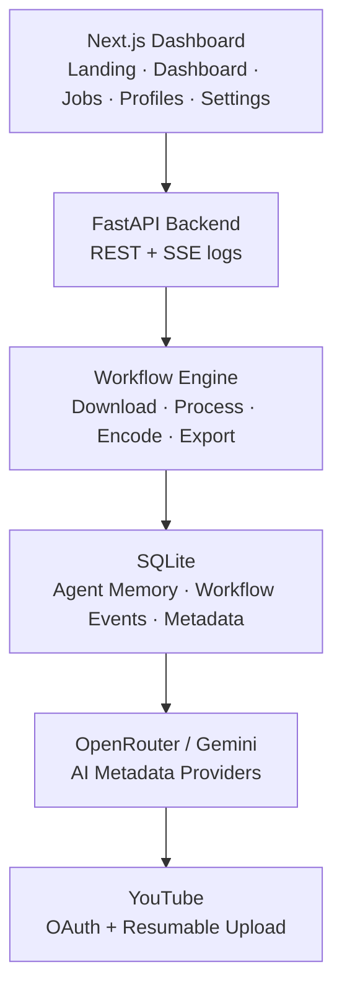
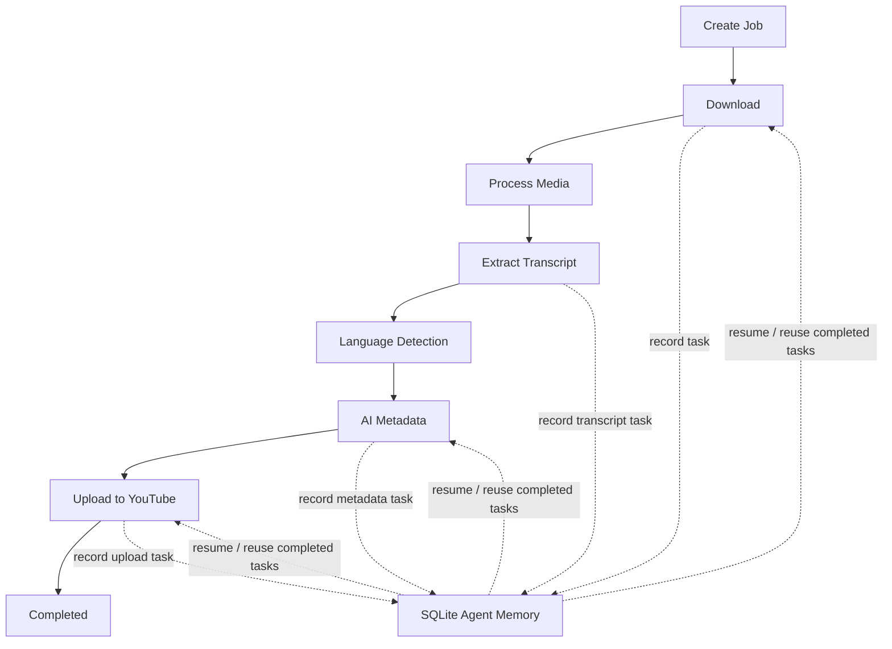

# CashCow

<p align="center">
  <strong>Offline-first AI-powered YouTube Automation Platform</strong>
</p>

<p align="center">
  CashCow is an offline-first AI workflow platform that automates YouTube content production while keeping creators in control.
  It downloads videos, processes media, extracts transcripts, generates AI-powered metadata with multiple LLM providers,
  and uploads directly to YouTube through a resilient workflow backed by SQLite Agent Memory.
</p>

<p align="center">
  <a href="#features"></a>
  <a href="#tech-stack"></a>
  <a href="#tech-stack"></a>
  <a href="#agent-memory"></a>
  <a href="#license"></a>
  <a href="#"></a>
  <a href="#"></a>
</p>

<p align="center">
  <a href="#demo">Demo</a>
  ·
  <a href="#features">Features</a>
  ·
  <a href="#architecture">Architecture</a>
  ·
  <a href="#installation">Installation</a>
  ·
  <a href="#roadmap">Roadmap</a>
</p>

> [!NOTE]
> CashCow is built as a local two-process app: a FastAPI backend on `localhost:8000` and a Next.js dashboard on `localhost:3000`.
> The hosted/demo UI can run without a backend, but real workflows require the local backend.

---

## Screenshots

Add final screenshots under `docs/screenshots/` and replace these placeholders before publishing a release.

| Landing Page | Dashboard | Workflow |
| --- | --- | --- |
|  |  |  |

| Demo Mode | Dark Theme | Light Theme |
| --- | --- | --- |
|  |  |  |

---

## Demo

| Resource | Link |
| --- | --- |
| Live Demo | `TODO: add deployed frontend URL` |
| Demo Video | `TODO: add YouTube/Loom walkthrough` |
| Screenshots | `TODO: add docs/screenshots/ assets` |

> [!TIP]
> Demo Mode is intentional: the frontend clearly explains when the dashboard is running without the local backend and disables real workflow actions instead of surfacing broken errors.

---

## Why CashCow?

Creators often repeat the same production loop: find a source video, download it, cut it, resize it, apply a house style, write YouTube metadata, upload, and track what happened. That loop is slow, fragile, and usually split across multiple tools.

CashCow turns that loop into a controlled local workflow:

- **Less repetitive production work**: one job coordinates download, processing, metadata, and upload.
- **More control**: creative profiles keep resize, audio, color, overlay, and export choices explicit.
- **More resilience**: workflow events and Agent Memory record task progress so interrupted work can be detected and resumed.
- **More privacy**: videos are processed locally; cloud services are used only when configured for AI metadata or YouTube publishing.

### Why offline-first matters

Offline-first does not mean "never connects to the internet." It means the creator's machine is the center of gravity. Media processing, workflow state, and UI control stay local; external APIs are optional workflow steps rather than the foundation of the product.

### Why privacy matters

Video production often involves unpublished ideas, source material, transcripts, and channel strategy. CashCow keeps core workflow data local and makes external handoffs explicit: OpenRouter/Gemini for metadata and YouTube for upload.

---

## Features

| Feature | Status | What it does |
| --- | --- | --- |
| Offline-first | ✅ Implemented | Runs as a local FastAPI + Next.js app. Core media processing uses local workflow execution. |
| AI Metadata | ✅ Implemented | Generates YouTube titles, descriptions, and tags from job context. |
| OpenRouter Support | ✅ Implemented | Routes metadata generation through OpenRouter when `METADATA_PROVIDER=openrouter`. |
| Multi-model fallback | ✅ Implemented | OpenRouter provider tries configured models from `settings.yaml` in order. |
| SQLite Agent Memory | ✅ Implemented | Persists workflow events and task memory in `cashcow.db`. |
| Workflow Engine | ✅ Implemented | Adapts jobs into the existing pipeline engine: download, optional creative steps, encode, export. |
| Resume After Restart | ✅ Implemented | Startup reads unfinished Agent Memory records and marks unfinished jobs for recovery. |
| Transcript Extraction | ✅ Implemented | Reads downloaded subtitle files and strips VTT/SRT formatting for metadata context. |
| Language Detection | ✅ Implemented | Detects English, Hindi, and Hinglish with lightweight heuristics. |
| YouTube Upload | ✅ Implemented | OAuth-backed resumable upload endpoint integration with retry for upload failures. |
| Demo Mode | ✅ Implemented | Frontend detects backend availability and presents a polished no-backend state. |
| Modern Dashboard | ✅ Implemented | Premium SaaS dashboard for workflow creation, profiles, jobs, logs, and settings. |
| Dark/Light Theme | ✅ Implemented | Hydration-safe `next-themes` support for Light, Dark, and System themes. |
| Responsive UI | ✅ Implemented | App shell, landing page, dashboard, jobs, and forms adapt across desktop and mobile. |

---

## Architecture



CashCow uses the existing media workflow engine under `src/` without rewriting it. The FastAPI backend adapts UI-created jobs into fixed workflow definitions, tracks progress, streams logs over Server-Sent Events, stores task memory in SQLite, and hands final metadata to YouTube upload when credentials are configured.

---

## Workflow



The API queues jobs through a single-worker FIFO queue. Each job moves through a fixed workflow sequence, with optional creative steps emitted from the selected profile:

1. Download source video with hardened `yt-dlp` options.
2. Apply trim range when provided.
3. Apply profile-driven resize, audio, color, and overlay steps when enabled.
4. Encode and export the final MP4.
5. Extract subtitles/transcript context when available.
6. Generate metadata through Gemini, OpenRouter, or mock provider.
7. Upload to YouTube if OAuth credentials are configured.
8. Store workflow events and task memory in SQLite.

---

## Tech Stack

| Layer | Technology |
| --- | --- |
| Frontend | Next.js 15, React 19, TypeScript |
| Backend | FastAPI, Uvicorn, Pydantic |
| Database | SQLite with WAL mode |
| AI | Gemini provider, OpenRouter provider, mock provider |
| Workflow | Existing Python pipeline engine, `yt-dlp`, FFmpeg configuration |
| Styling | Tailwind CSS 4, `next-themes`, Lucide Icons, Framer Motion |
| Deployment | Local development scripts; deployment target is intentionally open |

---

## Project Structure

```text
youtube-cashcow/
├── README.md                         # Project README
├── app.py                            # Legacy/root CLI entry point for the media engine
├── settings.yaml                     # Engine + metadata model configuration
├── src/                              # Existing Python media workflow engine
│   ├── downloader.py
│   ├── pipeline/
│   ├── processor/
│   └── performance/
├── tests/                            # Engine-level tests
└── cashcow/                          # Current full-stack app
    ├── package.json                  # Monorepo dev scripts
    ├── backend/
    │   ├── app/
    │   │   ├── api/                  # FastAPI routes
    │   │   ├── core/                 # Config and environment handling
    │   │   ├── infrastructure/       # SQLite connection + repositories
    │   │   ├── models/               # Pydantic models
    │   │   └── services/             # Workflow, AI, queue, jobs, upload, profiles
    │   ├── tests/                    # Backend tests
    │   └── requirements.txt
    ├── frontend/
    │   ├── app/                      # Next.js App Router routes
    │   ├── components/               # Layout, landing, UI, demo mode, theme
    │   ├── features/                 # Workflow form, jobs logs, profile editor
    │   ├── lib/                      # API client and config
    │   └── package.json
    ├── downloads/                    # Runtime downloads
    ├── output/                       # Runtime exports
    ├── presets/
    └── workflows/
```

---

## Installation

### Prerequisites

- Node.js 20+
- Python 3.12+
- FFmpeg and FFprobe available on your `PATH`
- A browser with YouTube cookies if using the default hardened downloader settings

Install FFmpeg:

```bash
# macOS
brew install ffmpeg

# Ubuntu / Debian
sudo apt install ffmpeg
```

### 1. Clone

```bash
git clone <repository-url> youtube-cashcow
cd youtube-cashcow
```

### 2. Install monorepo tooling

```bash
cd cashcow
npm install
```

### 3. Install backend dependencies

```bash
cd backend
python -m venv .venv
source .venv/bin/activate
pip install --upgrade pip
pip install -r requirements.txt
cd ..
```

### 4. Install frontend dependencies

```bash
cd frontend
npm install
cd ..
```

### 5. Configure environment variables

Create `cashcow/backend/.env`:

```bash
cp backend/.env.example backend/.env 2>/dev/null || touch backend/.env
```

Add provider credentials as needed. See [Environment Variables](#environment-variables).

### 6. Run the app

From `cashcow/`:

```bash
npm run dev
```

Services:

| Service | URL |
| --- | --- |
| Frontend | `http://localhost:3000` |
| Backend | `http://localhost:8000` |
| Health Check | `http://localhost:8000/health` |

Run processes individually:

```bash
npm run dev:backend
npm run dev:frontend
```

---

## Environment Variables

CashCow starts without secrets, but AI metadata and YouTube upload require provider credentials.

### AI metadata

| Variable | Required | Default | Description |
| --- | --- | --- | --- |
| `METADATA_PROVIDER` | No | `gemini` | Selects `gemini`, `openrouter`, or `mock`. |
| `GEMINI_API_KEY` | For Gemini | None | Google Gemini API key. |
| `GEMINI_MODEL` | No | `gemini-2.5-flash` | Gemini model override. |
| `OPENROUTER_API_KEY` | For OpenRouter | None | OpenRouter API key. |
| `OPENROUTER_REFERER` | No | `http://localhost:8000` | Sent as OpenRouter `HTTP-Referer`. |
| `OPENROUTER_APP_TITLE` | No | `YouTube CashCow` | Sent as OpenRouter `X-Title`. |

Example:

```env
METADATA_PROVIDER=openrouter
OPENROUTER_API_KEY=sk-or-v1-your-key
OPENROUTER_REFERER=http://localhost:8000
OPENROUTER_APP_TITLE=CashCow
```

OpenRouter model fallback is configured in `settings.yaml`:

```yaml
metadata:
  provider: openrouter
  models:
    - deepseek/deepseek-v4-flash:free
    - tencent/hy3:free
    - nvidia/nemotron-3-ultra:free
```

### YouTube upload

| Variable | Required | Default | Description |
| --- | --- | --- | --- |
| `YOUTUBE_CLIENT_ID` | For OAuth/upload | None | Google OAuth client ID. |
| `YOUTUBE_CLIENT_SECRET` | For OAuth/upload | None | Google OAuth client secret. |
| `YOUTUBE_REFRESH_TOKEN` | For upload | None | Stored automatically after OAuth callback when provided by Google. |
| `YOUTUBE_REDIRECT_URI` | No | `http://localhost:8000/youtube/auth/callback` | OAuth redirect URI. |
| `YOUTUBE_TOKEN_URI` | No | `https://oauth2.googleapis.com/token` | OAuth token endpoint. |
| `YOUTUBE_RESUMABLE_UPLOAD_URL` | No | YouTube upload API URL | Resumable upload endpoint. |
| `YOUTUBE_PRIVACY_STATUS` | No | `private` | Upload privacy status. |
| `YOUTUBE_CATEGORY_ID` | No | `22` | YouTube category ID. |
| `YOUTUBE_MADE_FOR_KIDS` | No | `false` | Sets `selfDeclaredMadeForKids`. |
| `YOUTUBE_ACCOUNT_ID` | No | `default` | Local account identifier for the MVP upload account. |

Example:

```env
YOUTUBE_CLIENT_ID=your-google-client-id
YOUTUBE_CLIENT_SECRET=your-google-client-secret
YOUTUBE_PRIVACY_STATUS=private
YOUTUBE_CATEGORY_ID=22
YOUTUBE_MADE_FOR_KIDS=false
```

Connect the account:

```text
GET http://localhost:8000/youtube/auth/start
```

### Downloader hardening

| Variable | Required | Default | Description |
| --- | --- | --- | --- |
| `CASHCOW_DL_BROWSER` | No | `chrome` | Browser cookie store used by `yt-dlp`. |
| `CASHCOW_DL_USE_BROWSER_COOKIES` | No | `true` | Enables browser cookies for YouTube downloads. |
| `CASHCOW_DL_REMOTE_COMPONENTS` | No | `ejs:github` | Remote components passed to `yt-dlp`; empty disables them. |

---

## Demo Mode

Demo Mode exists so the frontend can be shown without requiring a running backend, YouTube credentials, or local FFmpeg setup.

When the dashboard cannot reach `http://localhost:8000/health`, it:

- shows a polished **Demo Mode** banner,
- explains that the backend is offline,
- disables real workflow submission,
- keeps navigation, forms, profiles, themes, and layout previewable.

To enable real workflows:

```bash
cd cashcow
npm run dev:backend
```

The header status changes from backend offline to server running when the health check succeeds.

---

## Agent Memory

CashCow uses SQLite as Agent Memory for workflow recovery and task reuse.

Database file:

```text
cashcow.db
```

Tables created by the backend:

| Table | Purpose |
| --- | --- |
| `jobs` | Persistent job identity records used by infrastructure repositories. |
| `metadata` | Generated metadata storage shape. |
| `workflow_events` | Stage transitions and completion events. |
| `agent_memory` | Task-level memory for download, transcript extraction, metadata, and upload. |

Agent Memory allows CashCow to:

- record completed workflow tasks,
- detect unfinished jobs on backend startup,
- reuse completed metadata/upload tasks when a workflow resumes,
- keep recovery logic separate from the UI.

> [!IMPORTANT]
> The current API job list is process-memory backed for live UI state, while Agent Memory persists workflow recovery records in SQLite. This keeps the MVP fast and simple while preserving the foundation for fully persistent job history.

---

## AI Metadata Pipeline

CashCow's metadata pipeline turns workflow context into YouTube-ready copy:

1. **Transcript extraction**  
   Subtitle files downloaded by the workflow are parsed from VTT/SRT into plain text.

2. **Language detection**  
   Lightweight heuristics detect English, Hindi, or Hinglish using Devanagari and Latin character patterns.

3. **Prompt generation**  
   The final prompt combines transcript, duration, title seed, and creative-profile guidance.

4. **Provider execution**  
   `METADATA_PROVIDER` selects Gemini, OpenRouter, or mock provider.

5. **OpenRouter fallback**  
   The OpenRouter provider reads model order from `settings.yaml` and switches models on timeout, rate limit, server error, empty response, or repeated invalid JSON.

6. **JSON validation**  
   Provider output is validated against the expected metadata schema: `title`, `description`, and `tags`.

7. **Fallback metadata**  
   If provider generation fails, the workflow attempts deterministic fallback metadata so the job output remains useful.

---

## Design Philosophy

### Offline-first

The local machine owns the workflow. CashCow treats cloud services as explicit integrations, not as a prerequisite for editing or processing.

### Privacy-first

Source media, workflow state, and profile configuration stay local. AI and YouTube APIs receive only the data needed for their configured stage.

### Deterministic workflows

Users do not submit arbitrary pipeline graphs from the UI. The backend builds a fixed, known workflow and parameterizes it with validated profile settings.

### Human control

CashCow automates production steps, but creators still choose the source, trim, profile, quality, metadata seed, and upload configuration.

---

## Roadmap

These items are future ideas and are not claimed as implemented.

- [ ] Fully persistent job history in SQLite
- [ ] Multi-account YouTube upload management
- [ ] Metadata review/edit screen before upload
- [ ] Batch job creation
- [ ] Scheduled publishing
- [ ] Cloud deployment recipe
- [ ] Docker Compose development environment
- [ ] Built-in screenshot/demo asset generation for documentation
- [ ] OAuth status UI in settings
- [ ] Richer language detection with confidence scores
- [ ] Per-channel creative profile libraries
- [ ] End-to-end Playwright test suite for the dashboard

---

## Contributing

Contributions are welcome. CashCow is easiest to improve when changes are small, tested, and explicit about behavior.

### Development workflow

1. Fork the repository.
2. Create a feature branch.
3. Install backend and frontend dependencies.
4. Run the relevant tests and checks.
5. Open a pull request with screenshots for UI changes.

### Useful commands

```bash
# Frontend
cd cashcow/frontend
npm run lint
npm run build

# Backend tests
cd cashcow/backend
pytest

# Full local app
cd cashcow
npm run dev
```

### Pull request expectations

- Keep routing and business logic changes explicit.
- Add or update tests for backend behavior.
- Include screenshots or screen recordings for UI changes.
- Document any new environment variables.
- Do not commit runtime downloads, exports, local databases, or secrets.

---

## License

MIT License placeholder. Add the final `LICENSE` file before publishing a public release.

---

## Acknowledgements

CashCow builds on excellent open-source and platform tools:

- [Next.js](https://nextjs.org/)
- [FastAPI](https://fastapi.tiangolo.com/)
- [SQLite](https://www.sqlite.org/)
- [OpenRouter](https://openrouter.ai/)
- [Tailwind CSS](https://tailwindcss.com/)
- [Lucide Icons](https://lucide.dev/)
- [yt-dlp](https://github.com/yt-dlp/yt-dlp)
- [FFmpeg](https://ffmpeg.org/)

---

<p align="center">
  <strong>Built with ❤️ for creators who value privacy, automation, and control.</strong>
</p>
