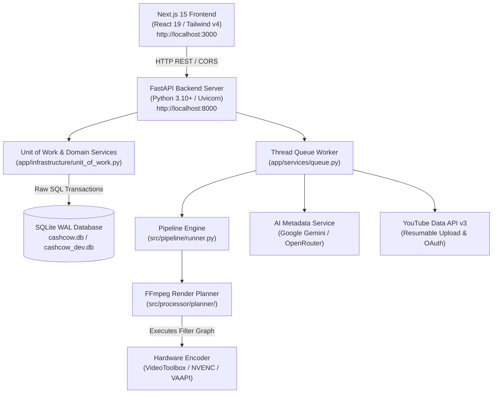
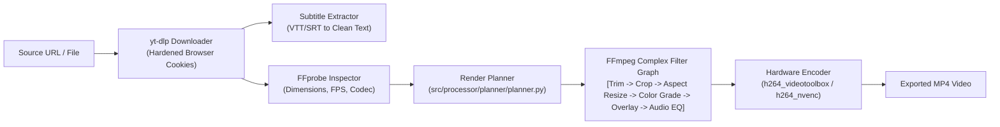
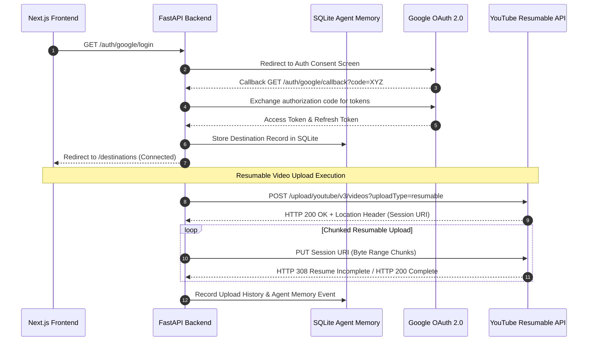

# CashCow

<p align="center">
  <strong>Offline-first AI-powered YouTube Content Automation & Processing Engine</strong>
</p>

<p align="center">
  CashCow is an offline-first, local video processing and YouTube automation platform. It seamlessly links media downloading, multi-stage FFmpeg video rendering, AI-driven video metadata generation, SQLite agent memory persistence, and YouTube Data API v3 resumable uploading into an integrated, resilient workflow.
</p>

<p align="center">
  <a href="#installation"></a>
  <a href="#installation"></a>
  <a href="#installation"></a>
  <a href="#database--persistence"></a>
  <a href="#testing"></a>
  <a href="#license"></a>
</p>

<p align="center">
  <a href="#architecture">Architecture</a>
  ·
  <a href="#feature-highlights">Features</a>
  ·
  <a href="#quick-start">Quick Start</a>
  ·
  <a href="#api-overview">API Reference</a>
  ·
  <a href="#user-guide">User Guide</a>
  ·
  <a href="#developer-guide">Developer Guide</a>
  ·
  <a href="#troubleshooting">Troubleshooting</a>
</p>

---

## 📷 UI Screenshots

| Workflow Studio | Creative Profiles | Channel Destinations |
| --- | --- | --- |
|  |  |  |

| Execution Logs & Real-Time Monitor | Dark Mode UI | Light Mode UI |
| --- | --- | --- |
|  |  |  |

---

## 🏗️ Architecture

CashCow operates as a local two-process monorepo application wrapping a standalone Python media processing engine. The local machine acts as the center of gravity; cloud LLMs and YouTube publishing APIs are optional external workflow steps.

### System Overview Diagram


```mermaid
graph TD
    Client["Next.js 15 Frontend\n(React 19 / Tailwind v4)\nhttp://localhost:3000"]
    API["FastAPI Backend Server\n(Python 3.10+ / Uvicorn)\nhttp://localhost:8000"]
    WorkerQ["Thread Queue Worker\n(app/services/queue.py)"]
    UOW["Unit of Work & Domain Services\n(app/infrastructure/unit_of_work.py)"]
    SQLite[("SQLite WAL Database\ncashcow.db / cashcow_dev.db")]
    Pipeline["Pipeline Engine\n(src/pipeline/runner.py)"]
    FFmpeg["FFmpeg Render Planner\n(src/processor/planner/)"]
    Hardware["Hardware Encoder\n(VideoToolbox / NVENC / VAAPI)"]
    AI["AI Metadata Service\n(Google Gemini / OpenRouter)"]
    YT["YouTube Data API v3\n(Resumable Upload & OAuth)"]

    Client -->|HTTP REST / CORS| API
    API --> WorkerQ
    API --> UOW
    UOW -->|Raw SQL Transactions| SQLite
    WorkerQ --> Pipeline
    Pipeline --> FFmpeg
    FFmpeg -->|Executes Filter Graph| Hardware
    WorkerQ --> AI
    WorkerQ --> YT
```

### Video Processing & Render Planner Filter Graph

The render engine converts high-level creative profile parameters into a single-pass FFmpeg filter graph to avoid lossy intermediate re-encodes.


```mermaid
flowchart LR
    URL["Source URL / File"] --> Download["yt-dlp Downloader\n(Hardened Browser Cookies)"]
    Download --> Subtitles["Subtitle Extractor\n(VTT/SRT to Clean Text)"]
    Download --> FFprobe["FFprobe Inspector\n(Dimensions, FPS, Codec)"]
    FFprobe --> Planner["Render Planner\n(src/processor/planner/planner.py)"]
    Planner --> FilterGraph["FFmpeg Complex Filter Graph\n[Trim -> Crop -> Aspect Resize -> Color Grade -> Overlay -> Audio EQ]"]
    FilterGraph --> Encoder["Hardware Encoder\n(h264_videotoolbox / h264_nvenc)"]
    Encoder --> Export["Exported MP4 Video"]
```

### YouTube Google OAuth 2.0 & Upload Pipeline Flow


```mermaid
sequenceDiagram
    autonumber
    participant UI as Next.js Frontend
    participant API as FastAPI Backend
    participant DB as SQLite Agent Memory
    participant Google as Google OAuth 2.0
    participant YT as YouTube Resumable API

    UI->>API: GET /auth/google/login
    API->>Google: Redirect to Auth Consent Screen
    Google-->>API: Callback GET /auth/google/callback?code=XYZ
    API->>Google: Exchange authorization code for tokens
    Google-->>API: Access Token & Refresh Token
    API->>DB: Store Destination Record in SQLite
    API-->>UI: Redirect to /destinations (Connected)
    
    Note over UI,YT: Resumable Video Upload Execution
    API->>YT: POST /upload/youtube/v3/videos?uploadType=resumable
    YT-->>API: HTTP 200 OK + Location Header (Session URI)
    loop Chunked Resumable Upload
        API->>YT: PUT Session URI (Byte Range Chunks)
        YT-->>API: HTTP 308 Resume Incomplete / HTTP 200 Complete
    end
    API->>DB: Record Upload History & Agent Memory Event
```

---

## ✨ Feature Highlights

| Feature Name | Status | Production Ready | Description | Primary Files |
| :--- | :--- | :--- | :--- | :--- |
| **Local Workflow Engine** | Active | ✅ Production | In-process execution of download, rendering, metadata generation, and uploading. | [runner.py](file:///Users/abhishek/Documents/youtube-cashcow/src/pipeline/runner.py), [workflow.py](file:///Users/abhishek/Documents/youtube-cashcow/cashcow/backend/app/services/workflow.py) |
| **FFmpeg Filter Planner** | Active | ✅ Production | Generates single-pass optimized FFmpeg filter graphs for cropping, resizing, color grading, and audio overlays. | [planner.py](file:///Users/abhishek/Documents/youtube-cashcow/src/processor/planner/planner.py), [filter_graph.py](file:///Users/abhishek/Documents/youtube-cashcow/src/processor/planner/filter_graph.py) |
| **Hardware Acceleration** | Active | ✅ Production | Auto-detects VideoToolbox (macOS), NVENC (NVIDIA), VAAPI, and QSV hardware codecs. | [hardware.py](file:///Users/abhishek/Documents/youtube-cashcow/src/performance/hardware.py) |
| **Hardened Downloader** | Active | ✅ Production | Resilient `yt-dlp` wrapper utilizing browser cookies and anti-bot evasions. | [hardened_downloader.py](file:///Users/abhishek/Documents/youtube-cashcow/cashcow/backend/app/services/hardened_downloader.py) |
| **Creative Profiles** | Active | ✅ Production | YAML/JSON-backed styling configurations for aspect ratios, overlays, audio equalizers, and color presets. | [profiles.py](file:///Users/abhishek/Documents/youtube-cashcow/cashcow/backend/app/services/profiles.py), [yaml_profile_repository.py](file:///Users/abhishek/Documents/youtube-cashcow/cashcow/backend/app/infrastructure/repositories/yaml_profile_repository.py) |
| **AI Metadata Provider** | Active | ✅ Production | Generates YouTube titles, descriptions, and tags using Google Gemini or OpenRouter. | [metadata.py](file:///Users/abhishek/Documents/youtube-cashcow/cashcow/backend/app/services/metadata.py), [openrouter_provider.py](file:///Users/abhishek/Documents/youtube-cashcow/cashcow/backend/app/services/ai/openrouter_provider.py) |
| **OpenRouter Fallback** | Active | ✅ Production | Sequentially attempts fallback LLMs (`deepseek`, `qwen`, `llama`) on provider error or rate-limiting. | [openrouter_provider.py](file:///Users/abhishek/Documents/youtube-cashcow/cashcow/backend/app/services/ai/openrouter_provider.py) |
| **YouTube Resumable Upload** | Active | ✅ Production | Direct chunked upload to YouTube Data API v3 with automatic retry and token management. | [youtube_upload.py](file:///Users/abhishek/Documents/youtube-cashcow/cashcow/backend/app/services/youtube_upload.py) |
| **SQLite Agent Memory** | Active | ✅ Production | Task memory and event log persistence enabling state recovery after server restarts. | [sqlite_memory_repository.py](file:///Users/abhishek/Documents/youtube-cashcow/cashcow/backend/app/infrastructure/repositories/sqlite_memory_repository.py) |
| **Frontend Demo Mode** | Active | ✅ Production | Next.js status indicator and UI safety wrapper for operating gracefully when the backend is offline. | [server-status.tsx](file:///Users/abhishek/Documents/youtube-cashcow/cashcow/frontend/features/server-status.tsx) |
| **OpenAI OAuth Provider** | Experimental | 🧪 Experimental | Local bridge for OpenAI OAuth authentication proxies. | [openai_oauth_provider.py](file:///Users/abhishek/Documents/youtube-cashcow/cashcow/backend/app/services/ai/openai_oauth_provider.py) |

---

## ⚡ Quick Start

Execute both the FastAPI backend (`:8000`) and Next.js frontend (`:3000`) concurrently using the root workspace runner:

```bash
# 1. Clone repository
git clone https://github.com/asliabhi12/youtube-cashcow.git
cd youtube-cashcow

# 2. Enter full-stack workspace and install Node dependencies
cd cashcow
npm install

# 3. Create virtual environment and install backend Python dependencies
cd backend
python3 -m venv .venv
source .venv/bin/activate
pip install -r requirements.txt
cd ..

# 4. Launch both Backend and Frontend concurrently
npm run dev
```

Visit the dashboard at **`http://localhost:3000`**. The FastAPI documentation is available at **`http://localhost:8000/docs`**.

---

## 📦 Installation Guide

### System Prerequisites
- **Python**: `3.10` or higher
- **Node.js**: `18.0.0` or higher (`npm` `v9+`)
- **FFmpeg & FFprobe**: Must be installed and accessible on system `PATH`.

#### System Package Installation

##### macOS (Homebrew)
```bash
brew install python ffmpeg node
```

##### Linux (Ubuntu/Debian)
```bash
sudo apt update
sudo apt install -y python3 python3-venv python3-pip ffmpeg nodejs npm
```

##### Windows (Chocolatey)
```powershell
choco install python ffmpeg nodejs
```

---

### Environment & Workspace Setup

#### 1. Setup Backend Environment
```bash
cd cashcow/backend
python3 -m venv .venv

# On macOS/Linux:
source .venv/bin/activate

# On Windows PowerShell:
# .venv\Scripts\Activate.ps1

pip install --upgrade pip
pip install -r requirements.txt
```

#### 2. Configure Environment Variables
Copy `.env.example` to `.env` in `cashcow/backend/.env`:

```bash
cp .env.example .env
```

Edit `.env` to configure your API keys:
```env
ENVIRONMENT=development
METADATA_PROVIDER=openrouter
OPENROUTER_API_KEY=your_openrouter_api_key
GEMINI_API_KEY=your_gemini_api_key
YOUTUBE_CLIENT_ID=your_google_client_id
YOUTUBE_CLIENT_SECRET=your_google_client_secret
YOUTUBE_REDIRECT_URI=http://localhost:8000/oauth/google/callback
FRONTEND_DESTINATIONS_URL=http://localhost:3000/destinations
CASHCOW_DL_BROWSER=chrome
```

#### 3. Setup Frontend Environment
```bash
cd ../frontend
npm install
```

---

## 🔧 Configuration Reference

CashCow loads configuration parameters from `settings.yaml`, environment variables (`.env`), and Pydantic application configs (`app/core/config.py`).

| Environment Variable | Required | Default Value | Description |
| :--- | :--- | :--- | :--- |
| `ENVIRONMENT` | Optional | `development` | Environment mode (`development`, `testing`, `production`). |
| `METADATA_PROVIDER` | Optional | `openrouter` | AI provider choice (`openrouter` or `gemini`). |
| `OPENROUTER_API_KEY` | Optional* | `""` | OpenRouter API authentication key (Required if provider is `openrouter`). |
| `GEMINI_API_KEY` | Optional* | `""` | Google Gemini API key (Required if provider is `gemini`). |
| `AI_PROVIDER` | Optional | `openai-oauth` | Generic AI provider name fallback. |
| `AI_BASE_URL` | Optional | `http://127.0.0.1:10531/v1` | Local or custom OpenAI-compatible proxy gateway URL. |
| `AI_MODEL` | Optional | `gpt-5.6-sol` | Default model tag for generic AI provider calls. |
| `YOUTUBE_CLIENT_ID` | Optional* | `""` | Google Cloud OAuth 2.0 Client ID for YouTube Data API. |
| `YOUTUBE_CLIENT_SECRET` | Optional* | `""` | Google Cloud OAuth 2.0 Client Secret. |
| `YOUTUBE_REDIRECT_URI` | Optional | `http://localhost:8000/oauth/google/callback` | OAuth authorization code callback URI. |
| `FRONTEND_DESTINATIONS_URL` | Optional | `http://localhost:3000/destinations` | Post-OAuth browser redirect target. |
| `CASHCOW_DL_BROWSER` | Optional | `chrome` | Browser profile source for extraction of cookies during downloading. |

---

## 🗄️ Database & Persistence Architecture

CashCow uses a local SQLite database (`cashcow.db` for production, `cashcow_dev.db` for development, `test_cashcow.db` for testing) configured with **Write-Ahead Logging (WAL)** for high-concurrency read/write operations.

```
                  +-----------------------------------+
                  |   FastAPI Request / Worker Thread |
                  +-----------------------------------+
                                    |
                                    v
                  +-----------------------------------+
                  | SQLiteUnitOfWork (ContextManager) |
                  +-----------------------------------+
                   /        |                   \
                  v         v                    v
      +---------------+ +---------------+ +------------------+
      | JobRepository | | MemRepository | | DestRepository   |
      +---------------+ +---------------+ +------------------+
                  \         |                   /
                   v        v                  v
                  +-----------------------------------+
                  | sqlite3.Connection (WAL Mode)     |
                  +-----------------------------------+
```

### Database Tables & Schema

1. **`jobs`**: Tracks video processing workflow requests, parameters, status (`pending`, `queued`, `running`, `completed`, `failed`, `cancelled`), profile settings, and output video file paths.
2. **`metadata`**: Stores AI-generated YouTube metadata (titles, descriptions, tags, category IDs) linked to job IDs.
3. **`workflow_events`**: Time-series log of discrete steps executed during a job run (download, render, metadata generation, upload).
4. **`agent_memory`**: Key-value memory entries for long-running workflows, allowing state restoration across application restarts.
5. **`destinations`**: Stores YouTube publishing channel configurations, including encrypted Google OAuth 2.0 access and refresh tokens.
6. **`upload_history`**: Records completed YouTube uploads, assigned video IDs, publishing privacy status, and timestamps.
7. **`oauth_states`**: Security state tokens used to prevent CSRF attacks during the Google OAuth 2.0 exchange flow.

---

## 📖 User Guide

### 1. Connecting a YouTube Channel Destination
1. Open the dashboard at `http://localhost:3000/destinations`.
2. Ensure `YOUTUBE_CLIENT_ID` and `YOUTUBE_CLIENT_SECRET` are configured in `cashcow/backend/.env`.
3. Click **Connect YouTube Channel**.
4. Authenticate via Google OAuth consent screen and grant YouTube video manage permissions.
5. Upon authorization, you will be redirected back to `/destinations` with your channel listed.

### 2. Creating a Custom Creative Profile
1. Navigate to `http://localhost:3000/profiles`.
2. Click **New Profile** or edit an existing profile.
3. Configure parameters:
   - **Target Aspect Ratio**: `9:16` (Vertical Short) or `16:9` (Standard Horizontal).
   - **Audio Equalizer**: Enable normalization, vocal boost, or low-cut filters.
   - **Color Preset**: Cinematic, Warm, Contrast, or Custom LUT values.
   - **Overlay Watermark**: Upload a PNG logo via `/assets/upload` and configure positioning.
4. Save the profile. It will be stored in `profiles/custom/<profile_id>.json`.

### 3. Executing a Video Workflow
1. Navigate to the **Workflow Studio** (`http://localhost:3000`).
2. Paste a source YouTube video URL or select a local video file.
3. Select your desired **Creative Profile** and **Publishing Destination**.
4. Optional: Enter custom AI instructions (e.g., *"Focus title on technological breakthroughs"*).
5. Click **Start Workflow**.
6. Monitor execution in real-time under **Job Logs**. The system will download, process FFmpeg filters, generate AI metadata, and publish to YouTube.

### 4. Job Recovery after Interruptions
If the server restarts during an active run, CashCow's startup sequence runs `resume_unfinished_jobs()`. Interrupted jobs are marked for recovery or re-enqueued automatically.

---

## 💻 Developer Guide

### Core Architecture Principles
1. **Repository Pattern & Unit of Work**: All database interactions pass through abstract repositories (`JobRepository`, `MemoryRepository`, `DestinationRepository`) controlled by `SQLiteUnitOfWork` in [unit_of_work.py](file:///Users/abhishek/Documents/youtube-cashcow/cashcow/backend/app/infrastructure/unit_of_work.py).
2. **Domain Event Bus**: Internal events (`JobStarted`, `JobCompleted`, `JobFailed`) are dispatched via [events.py](file:///Users/abhishek/Documents/youtube-cashcow/cashcow/backend/app/domain/events.py) to decouple workflow triggers from API controllers.
3. **Single-Pass FFmpeg Rendering**: Render planning compiles all video manipulations into a single `-filter_complex` string to maximize encoding speed and preserve video quality.

### Adding a New AI Provider
To add a new AI metadata provider (e.g., Anthropic Claude or Ollama):

1. Create a provider file in `cashcow/backend/app/services/ai/claude_provider.py`.
2. Implement the `MetadataProvider` interface from [metadata_provider.py](file:///Users/abhishek/Documents/youtube-cashcow/cashcow/backend/app/services/ai/metadata_provider.py):
   ```python
   from app.services.ai.metadata_provider import MetadataProvider
   from app.models.metadata import VideoMetadata

   class ClaudeProvider(MetadataProvider):
       def generate_metadata(self, prompt: str, transcript: str) -> VideoMetadata:
           # Implement API invocation logic
           ...
   ```
3. Register the provider in `cashcow/backend/app/services/ai/provider_factory.py`.

### Adding a New FFmpeg Video Effect
1. Add the effect model schema in `src/processor/models.py`.
2. Create the filter generator in `src/processor/<effect_name>.py`.
3. Wire the effect stage into `src/processor/planner/filter_graph.py`:
   ```python
   def build_filter_graph(plan: RenderPlan) -> str:
       filters = []
       # ... existing filters ...
       if plan.custom_effect:
           filters.append(f"custom_filter={plan.custom_effect.parameter}")
       return ";".join(filters)
   ```

---

## 🌐 API Reference

### Health Probe
```http
GET /health
```
**Response (200 OK)**:
```json
{
  "status": "ok",
  "version": "0.1.0"
}
```

---

### List Workflow Jobs
```http
GET /jobs?limit=10&offset=0
```
**Response (200 OK)**:
```json
[
  {
    "id": "job_12345678",
    "status": "completed",
    "url": "https://www.youtube.com/watch?v=dQw4w9WgXcQ",
    "profile_id": "youtube_short_cinematic",
    "created_at": "2026-07-31T12:00:00Z",
    "output_path": "/path/to/output/processed_video.mp4"
  }
]
```

---

### Submit New Job
```http
POST /jobs
Content-Type: application/json

{
  "url": "https://www.youtube.com/watch?v=dQw4w9WgXcQ",
  "profile_id": "youtube_short_masked",
  "destination_id": "dest_yt_channel_1",
  "custom_prompt": "Create an engaging tech summary title and description"
}
```
**Response (201 Created)**:
```json
{
  "id": "job_87654321",
  "status": "queued",
  "message": "Job successfully created and queued for processing."
}
```

---

### Regenerate AI Metadata
```http
POST /metadata/regenerate
Content-Type: application/json

{
  "job_id": "job_87654321",
  "override_prompt": "Generate high-CTR viral titles only"
}
```
**Response (200 OK)**:
```json
{
  "title": "5 Mind-Blowing Tech Innovations Changing Everything!",
  "description": "Discover how modern technology is evolving...",
  "tags": ["tech", "future", "innovation", "ai"],
  "category_id": "28"
}
```

---

## 📁 Repository Structure

```
youtube-cashcow/
├── app.py                     # Legacy CLI entry point for standalone core engine
├── cashcow.db                 # Production SQLite database (WAL mode)
├── requirements.txt           # Minimal root dependencies (pytest)
├── settings.yaml              # Core engine hardware, FFmpeg & model configuration
├── workflow.yaml              # Pipeline definition & effect rules
├── assets/                    # Static brand assets and default watermarks
├── profiles/                  # Builtin and custom creative profiles (YAML/JSON)
├── cashcow/                   # Full-Stack Web Application Monorepo
│   ├── package.json           # Monorepo runner (concurrently backend & frontend)
│   ├── backend/               # FastAPI Application Layer
│   │   ├── app/
│   │   │   ├── api/           # REST Endpoints (jobs, profiles, destinations, assets)
│   │   │   ├── core/          # App configuration, env loader & constants
│   │   │   ├── domain/        # Domain models, UnitOfWork interface, event definitions
│   │   │   ├── infrastructure/# SQLite database connection & raw-SQL repositories
│   │   │   ├── models/        # Pydantic schemas for request/response validation
│   │   │   └── services/      # Business logic (queue, AI providers, YouTube OAuth)
│   │   ├── requirements.txt   # Backend Python dependencies
│   │   └── tests/             # Backend integration & unit test suite
│   └── frontend/              # Next.js 15 + React 19 User Interface
│       ├── app/               # Next.js App Router layout and pages
│       ├── components/        # Reusable UI widgets (sliders, dialogs, dark theme)
│       ├── features/          # Domain modules (workflow form, job logs, status)
│       ├── lib/               # API client library (lib/api.ts)
│       └── package.json       # Next.js frontend dependencies
├── src/                       # Core Media Processing Engine
│   ├── downloader.py          # yt-dlp wrapper & hardening
│   ├── pipeline/              # Sequential pipeline executor & validator
│   ├── processor/             # FFmpeg filter graph builder, planners & video operators
│   └── performance/           # Hardware encoder detection (VideoToolbox, NVENC)
└── tests/                     # Core engine unit & performance test suite
```

---

## 🧪 Testing & Quality Assurance

The test suite covers core media processing, FFmpeg complex filter generation, hardware acceleration detection, SQLite transaction rollbacks, OpenRouter fallback mechanisms, and YouTube resumable upload protocols.

### Running Core Engine Tests
```bash
# From repository root
pytest tests/ -v
```

### Running Backend API Tests
```bash
# From cashcow/backend
cd cashcow/backend
pytest tests/ -v
```

### Key Test Specifications
- [test_processor.py](file:///Users/abhishek/Documents/youtube-cashcow/tests/test_processor.py): Verifies FFmpeg execution, probe parsing, and video aspect cropping.
- [test_render_planner.py](file:///Users/abhishek/Documents/youtube-cashcow/tests/test_render_planner.py): Validates complex filter graph strings generated for multi-effect profiles.
- [test_performance.py](file:///Users/abhishek/Documents/youtube-cashcow/tests/test_performance.py): Tests hardware acceleration codec auto-detection and multi-worker pools.
- [test_agent_memory.py](file:///Users/abhishek/Documents/youtube-cashcow/cashcow/backend/tests/test_agent_memory.py): Asserts workflow state persistence and task recovery across restarts.
- [test_openrouter_provider.py](file:///Users/abhishek/Documents/youtube-cashcow/cashcow/backend/tests/test_openrouter_provider.py): Verifies automatic model fallback upon LLM API rate limits.
- [test_unit_of_work_rollback.py](file:///Users/abhishek/Documents/youtube-cashcow/cashcow/backend/tests/test_unit_of_work_rollback.py): Confirms atomic SQLite transaction rollback on execution errors.

---

## ❓ Troubleshooting

### 1. YouTube OAuth Token / Callback Errors
- **Symptom**: `redirect_uri_mismatch` error during Google OAuth authorization.
- **Fix**: Ensure your Google Cloud Console Authorized Redirect URI exactly matches `http://localhost:8000/oauth/google/callback`.

### 2. FFmpeg Execution Failures
- **Symptom**: `FFmpegError: Unknown encoder 'h264_videotoolbox'` or `encoder not found`.
- **Fix**: Run `src/performance/hardware.py` or inspect FFmpeg codec support using `ffmpeg -encoders`. If hardware encoding fails, CashCow automatically falls back to software `libx264`.

### 3. SQLite Database Lock Errors (`database is locked`)
- **Symptom**: `sqlite3.OperationalError: database is locked`.
- **Fix**: Ensure SQLite WAL mode is enabled (`PRAGMA journal_mode=WAL;`). `app/infrastructure/database.py` executes this automatically on application startup.

### 4. Downloader Extraction Blocked (`yt-dlp` HTTP 429 / Sign-in required)
- **Symptom**: YouTube downloads fail with bot detection warnings.
- **Fix**: Set `CASHCOW_DL_BROWSER=chrome` (or `firefox`, `safari`) in `.env` to allow `yt-dlp` to pass local browser authentication cookies.

---

## 🗺️ Roadmap & Technical Debt

### Completed Features ✅
- [x] Monorepo setup with unified `npm run dev` script.
- [x] In-process Python pipeline execution from FastAPI queue worker.
- [x] Single-pass FFmpeg complex filter graph render planner.
- [x] SQLite Agent Memory and Unit of Work persistence pattern.
- [x] OpenRouter multi-model fallback strategy for AI metadata generation.
- [x] YouTube Data API v3 Google OAuth 2.0 and chunked resumable upload integration.
- [x] Next.js 15 App Router interface with built-in Demo Mode backend status detector.

### In Progress / Roadmap 🚧
- [ ] Concurrent batch video URL scheduling and queue management UI.
- [ ] Multi-account channel switcher for destination management.
- [ ] Automated end-to-end testing suite using Playwright for Next.js frontend.
- [ ] Custom WebSockets stream for real-time FFmpeg encoding progress bars.

### Technical Debt 🧹
- Deprecated `preset` field in `app/models/job.py` kept for legacy client backward compatibility.

---

## 📋 Documentation Audit

As required by the principal repository audit, below is the status breakdown of project documentation:

- **Missing Documentation**: Detailed guides for adding custom FFmpeg audio/video filters in `src/processor/` and custom LLM metadata providers.
- **Dead Documentation**: Old references suggesting starting backend and frontend separately without using the unified `npm run dev` script in `cashcow/`.
- **Stale Documentation**: Former placeholder URLs in early draft README files.
- **Missing Examples**: Step-by-step custom profile YAML definition templates under `profiles/custom/`.
- **Missing Diagrams**: Explicit sequence diagrams detailing the multi-chunk HTTP resumable upload protocol to YouTube servers.
- **Suggested Future Documentation Improvements**: Auto-generated API specs published to GitHub Pages from FastAPI's `/openapi.json`.

---

## 📄 License & Acknowledgements

Distributed under the **MIT License**.

Built with [FastAPI](https://fastapi.tiangolo.com/), [Next.js](https://nextjs.org/), [FFmpeg](https://ffmpeg.org/), [yt-dlp](https://github.com/yt-dlp/yt-dlp), and [SQLite](https://www.sqlite.org/).
